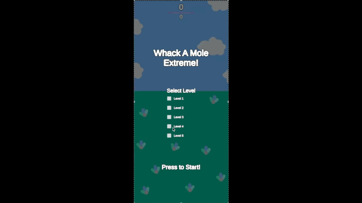

# Showcase

## Whack a mole
Create a simple clicking game with Unity engine, and try to build it to both iOS and Android. inspired by cookie clicker and Arcade whack a mole

### Tools
Unity 2021.3.16f1 
Dotween

### Playing The game
1. Add Unity Project folder with your unity hub. it use Unity 2021.3.16f1
2. After you done importing it, open Assets/Scenes/Game.scene
3. press play to play the game.

### Build
**** IOS 
1. install XCode
2. install iOS build support on unity hub
3. Build the game with unity will output xcode project
4. open Xcode and build step 3 with xcode to your phone

**** Android
1. install android build support with unity jdk,ndk,sdk.
2. connect your phone to this pc
3. turn on usb debugging on your phone
4. build the project.
